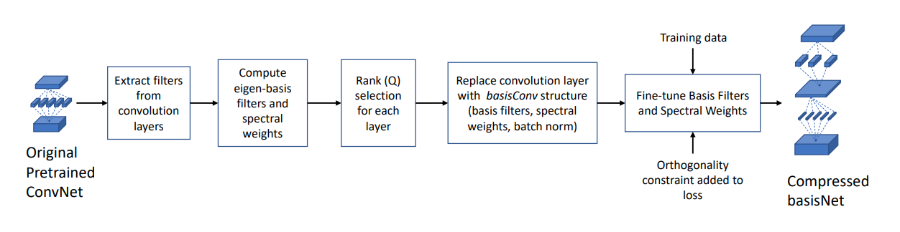

# Compressing Deep CNNs Using Basis Representation and Spectral Fine-Tuning ([Link](https://arxiv.org/abs/2105.10436)).

Pytorch implementation of "Compressing Deep CNNs Using Basis Representation and Spectral Fine-Tuning" (ICIP 2021).

<div align=center></div>


## Citation
Please consider citing:

```
@inproceedings{tayyab2021SFT,
author={Tayyab, Muhammad and Khan, Fahad Ahmad and Mahalanobis, Abhijit},
booktitle={2021 IEEE International Conference on Image Processing (ICIP)},
title={Compressing Deep CNNs Using Basis Representation and Spectral Fine-Tuning},
year={2021},
pages={3537-3541},
doi={10.1109/ICIP42928.2021.9506128}}
```

### Model Compression

Following commands can be used to reproduce the results presented in the paper. 

##### 1. Resnet56

| Flops          | Parameters    | Accuracy |
|----------------|---------------|----------|
| 90.08M(64.11%) | 0.31M(63.96%) | 92.95%   | 

```shell
python python train_cifar.py \
--jobid resnet56_test \
--arch resnet56 \
--dataset cifar10 \
--compress-rate 0.63 \
--l2-weight 0.001 \
--add-bn True \
--epochs 120 \
--schedule 30 60 90 \
--lr 0.01
```
